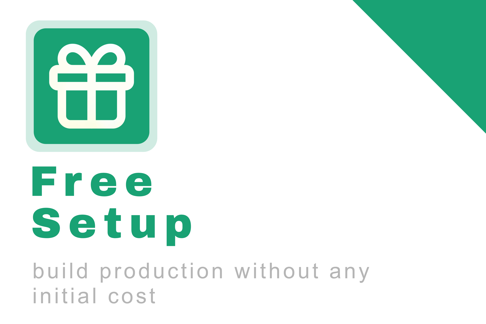
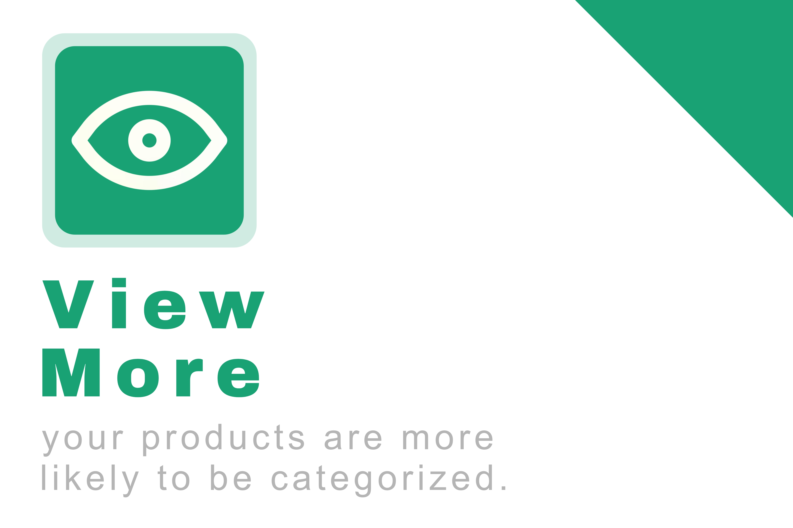

# honarino

Project designed for malayer, in this project you can create your own production page and move it your business into the honarino. you can Register/Login to the website and create the page, this is a simple, you can create the page in 5 min.

## 🚀 Features

- You can add products, and other users can see and make a comment for that product.
- You can change the, theme, content, products, events, ... into your own page.
- You can access to other's production and help to you to find the products that you want.
- You don't need much knowledge to create your vendor account.

## 💫 Why Honarino???

    
    
    

## 🛠️ Tech Stack

    
    
    
    
    
    
    

## 🖥️ Preview

    
    

    
    

 

-+- make your own business -+-

