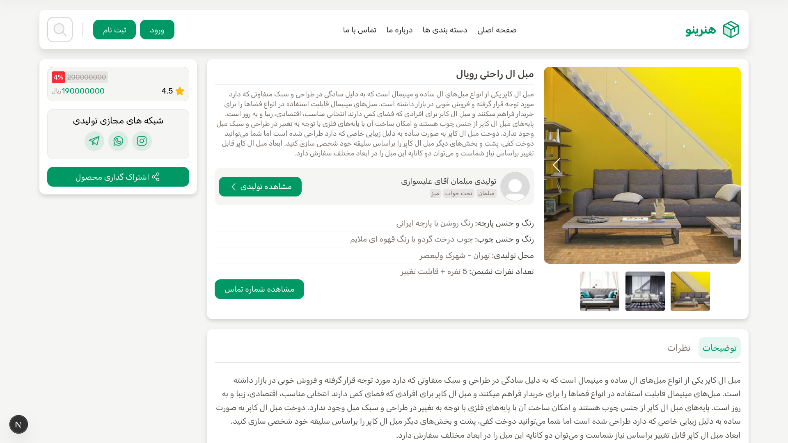

# honarino

Project designed for malayer, in this project you can create your own production page and move it your business into the honarino. you can Register/Login to the website and create the page, this is a simple, you can create the page in 5 min.

## 🚀 Features

- You can add products, and other users can see and make a comment for that product.
- You can change the, theme, content, products, events, ... into your own page.
- You can access to other's production and help to you to find the products that you want.
- You don't need much knowledge to create your vendor account.

## 🖥️ Preview

<p align="center">
    
    
</p>
<p align="center">
    
    
</p>

## 🛠️ Tech Stack

     

## 📁 Directory

```
.
├── backend
│   ├── cmd
│   ├── config
│   ├── db
│   ├── Dockerfile
│   ├── Dockerfile.dev
│   ├── go.mod
│   ├── go.sum
│   ├── internal
│   ├── Makefile
│   └── sqlc.yaml
├── frontend
│   ├── Dockerfile
│   ├── Dockerfile.develop
│   ├── eslint.config.mjs
│   ├── next.config.ts
│   ├── next-env.d.ts
│   ├── package.json
│   ├── package-lock.json
│   ├── postcss.config.mjs
│   ├── public
│   ├── src
│   └── tsconfig.json
├── docker-compose.dev.yml
├── docker-compose.hybrid.yml
├── docker-compose.yml
├── Makefile
└── README.md
```

---

<p align="center">-+- make your own business -+-</p>
